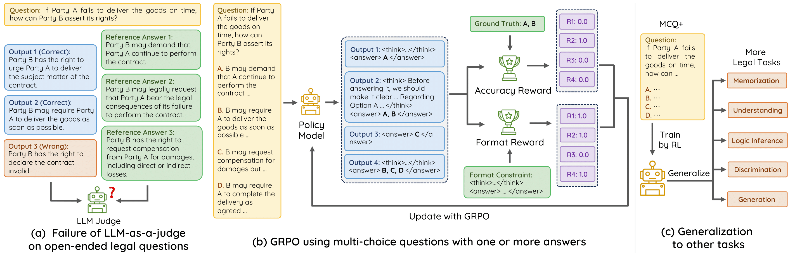

# DeepLawyer

[ZH](README_zh.md) [EN]

[](https://huggingface.co/pkupie/DeepLawyer-Zero/)
[]()


**LawyerZero** aims to enhance legal reasoning capabilities through reinforcement learning, following our previous project [Lawyer LLaMA](https://github.com/AndrewZhe/lawyer-llama). 


## Introduction

Recent advances in reinforcement learning (RL) have shown promise in enhancing the reasoning abilities of large language models (LLMs) by learning from math and coding tasks. However, applying RL to non-STEM fields like law is challenging due to the difficulty in verifying correctness and designing effective reward models. Unlike in STEM fields, legal answers can vary significantly in perspectives and expressions, making it hard to create reliable reward models.

We take the first step to address this challenge by proposing an **RL approach based on Multiple-Choice Questions with one or more answers (MCQ+)**. Our method leverages the definitiveness of MCQ+ answers to create a rule-based reward model, which enables us to build a legal reasoning model, DeepLawyer-Zero.

Results on the LexEval benchmark show our method brings an average improvement of 16.2% across diverse legal problem-solving abilities, and could achieve comparable legal reasoning abilities with GPT-4. 

## Installation
```
pip install -r requirement.txt
```

## Quick Start
We recommand use vllm for inference
```
python evaluation/generate.py
```
## Training
```
bash scripts/verl/run_lawyer_grpo.sh
```

## Evaluation
We use a custom data parallel function to speed up inference with vllm.
```
CUDA_VISIBLE_DEVICES=$gpu \
    python evaluation/eval.py \
    --benchmark all \
    --model_path $model \
    --max_tokens 4096 \
    --tensor_parallel_size 1 \
    --system_message r1-lawyer \
    --force_generate
```
You can run `--benchmark all` to evaluate on all the benchmarks or `--benchmark lexeval_1_1` on a specific task.

#### Handling Long Context such as 4-1 subtask in LexEval
By default, the context length for Qwen2.5 models are set to 32,768 tokens. To handle extensive inputs exceeding 32,768 tokens, we utilize YaRN following instructions in [Qwen documentation](https://qwen.readthedocs.io/en/latest/deployment/vllm.html#extended-context-support), a technique for enhancing model length extrapolation, ensuring optimal performance on lengthy texts.

```
{
  ...,
  "rope_scaling": {
    "factor": 4.0,
    "original_max_position_embeddings": 32768,
    "type": "yarn"
  }
}
```
Note: Using static YARN may potentially impact performance on shorter texts, as noted in the Qwen documentation. 

## Acknowledgement
Our RL framework is built upon [verl](https://github.com/volcengine/verl). We appreciate their excellent work.

## Limitations
This project is intended solely for academic research and should not be used for commercial purposes or any activities that could harm society. When using components involving third-party code, please adhere strictly to the respective open-source licenses.

The model outputs from this project are not professional legal advice and may contain inaccuracies. For legal assistance, please consult a qualified professional.

## Citation
```

```

## Contributors 
[Quzhe Huang](https://andrewzhe.github.io/)\*，[Zirui Wu](https://williamzr.github.io/)\*，Kangcheng Luo\*，[Zhenwei An](https://zhenweian.github.io/)\*，Cong Jiang\*，Tianyao Ma\*，[Yuchen Wang](https://wangyuchen333.github.io/)，[Chen Zhang](https://luciusssss.github.io/)，Yutong Hu，[Mingxu Tao](https://kobayashikanna01.github.io/index.html)，Wenya Wang，[Yansong Feng](https://yansongfeng.github.io/)