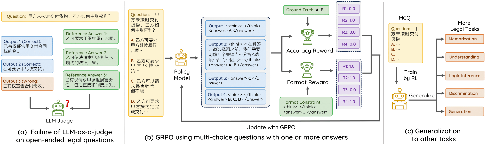

[](https://huggingface.co/pkupie/DeepLawyer-Zero/)
[]()

**DeepLawyer** 是我们之前的项目 [Lawyer LLaMA](https://github.com/AndrewZhe/lawyer-llama)的延续。在这个项目中我们将通过强化学习（Reinforcement Learning, RL）增强模型的法律推理能力，


## 简介


近期的工作表明通过强化学习可以在数学和编程任务中显著提升模型的推理能力。然而，将强化学习应用于法律等非STEM领域具有挑战性，因为法律问题的答案可能因视角和表达方式的不同而存在较大差异，这使得构建可靠的奖励模型变得困难。

为了解决这一问题，我们尝试基于**不定项选择题（MCQ+）进行强化学习**。我们的方法利用了MCQ+答案的明确性来构建基于规则的奖励模型，从而训练得到一个法律推理模型**DeepLawyer-Zero**

在LexEval基准测试中的结果显示，我们的方法在多样化的法律问题解决能力上平均提升了16.2%，并且其法律推理能力可与GPT-4相当。

## 安装
```
pip install -r requirements.txt
```

## 快速开始
我们推荐使用 `vllm` 进行推理：
```
python evaluation/generate.py
```

## 训练
```
bash scripts/verl/run_lawyer_grpo.sh
```

## 评估
我们使用自定义的数据并行功能加速 `vllm` 的推理。
```
CUDA_VISIBLE_DEVICES=$gpu \
    python evaluation/eval.py \
    --benchmark all \
    --model_path $model \
    --max_tokens 4096 \
    --tensor_parallel_size 1 \
    --system_message r1-lawyer \
    --force_generate
```
可以运行 `--benchmark all` 来在所有基准测试进行测试，或者运行 `--benchmark lexeval_1_1` 来评估特定任务。

#### 处理长上下文（如LexEval中的4-1子任务）
默认情况下，Qwen2.5模型的上下文长度设置为32,768个token。为了处理超过32,768个token的超长输入，我们在测试中按照[Qwen文档](https://qwen.readthedocs.io/en/latest/deployment/vllm.html#extended-context-support)的说明采用了YaRN技术，这是一种用于增强模型长度外推的技术，确保在长文本上的最佳性能。具体而言把以下内容加入到`config.json`中

```
{
  ...,
  "rope_scaling": {
    "factor": 4.0,
    "original_max_position_embeddings": 32768,
    "type": "yarn"
  }
}
```
注意：根据Qwen文档的说明，使用静态YaRN可能会对较短文本场景下的性能产生潜在影响。

## 致谢
我们的强化学习框架基于 [verl](https://github.com/volcengine/verl) 构建。感谢他们的出色工作。

## 局限性
本项目仅用于学术研究，不得用于商业用途或任何可能危害社会的活动。在使用涉及第三方代码和数据时，请严格遵守相应的开源许可证。

本项目生成的模型输出并非专业的法律建议，可能包含不准确的内容。如需法律帮助，请咨询专业人士。

## 引用
```

```

## 贡献者
[黄曲哲](https://andrewzhe.github.io/)\*，[伍子睿](https://williamzr.github.io/)\*，罗康诚\*，[安震威](https://zhenweian.github.io/)\*，姜聪\*，马天尧\*，[王昱琛](https://wangyuchen333.github.io/)，[张晨](https://luciusssss.github.io/)，胡雨桐，[陶铭绪](https://kobayashikanna01.github.io/index.html)，王文雅，[冯岩松](https://yansongfeng.github.io/)

\*核心贡献者

本项目是在冯岩松教授的指导下进行的。
